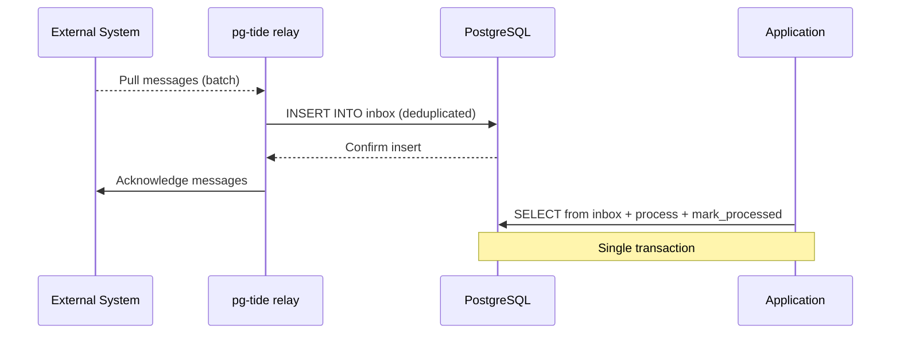

# Sources Overview

While sinks deliver messages *from* your PostgreSQL outbox *to* external systems, sources work in the opposite direction — they consume messages *from* external systems and deliver them *into* your PostgreSQL inbox. This is what pg_tide calls a "reverse pipeline." Think of it as an intake funnel: events from the outside world flow through the source, through the relay, and into your inbox table where your application can process them with full transactional guarantees and idempotent deduplication.

pg_tide supports 16 different sources, covering all the major message brokers, cloud services, and connector ecosystems. Any system that can produce messages can be connected to your PostgreSQL inbox.

## Why Use Sources?

The inbox pattern solves the same reliability problem as the outbox, but in reverse. When your application receives events from an external system, it needs to process them reliably — without losing messages, without processing duplicates, and without inconsistency between the event processing and your database state. By routing external events through a pg_tide inbox, your application processes them within a database transaction, gaining exactly-once semantics for free.

## How Sources Work

1. The relay connects to the external system as a consumer/subscriber
2. Messages are pulled (or pushed) from the external system in batches
3. Each message is written to the configured pg_tide inbox table
4. The inbox's deduplication mechanism (UNIQUE constraint on event_id) prevents duplicates
5. The relay acknowledges the messages to the external system
6. Your application processes inbox messages at its own pace within database transactions



## Available Sources

| Source | System | Direction |
|--------|--------|-----------|
| [PostgreSQL Outbox](outbox.md) | PostgreSQL outbox polling | Forward (outbox → sink) |
| [Apache Kafka](kafka.md) | Kafka consumer | Reverse |
| [NATS JetStream](nats.md) | NATS subscriber | Reverse |
| [RabbitMQ](rabbitmq.md) | RabbitMQ consumer | Reverse |
| [Redis Streams](redis.md) | Redis XREADGROUP | Reverse |
| [Amazon SQS](sqs.md) | SQS receiver | Reverse |
| [Amazon Kinesis](kinesis.md) | Kinesis reader | Reverse |
| [Google Cloud Pub/Sub](pubsub.md) | Pub/Sub subscriber | Reverse |
| [Azure Service Bus](servicebus.md) | Service Bus receiver | Reverse |
| [Azure Event Hubs](eventhubs.md) | Event Hubs reader | Reverse |
| [MQTT v5](mqtt.md) | MQTT subscriber | Reverse |
| [HTTP Webhook Receiver](webhook-receiver.md) | HTTP server | Reverse |
| [Singer / Meltano](singer.md) | Singer tap consumer | Reverse |
| [Airbyte](airbyte.md) | Airbyte source connector | Reverse |
| [stdin / File](stdin.md) | Standard input | Reverse |

## Configuring a Reverse Pipeline

Reverse pipelines are configured using `tide.relay_set_inbox()`:

```sql
SELECT tide.relay_set_inbox(
    'payments-from-stripe',      -- pipeline name
    'payment_events',            -- inbox name
    '{
        "source_type": "webhook",
        "listen_addr": "0.0.0.0:8080",
        "path": "/webhooks/stripe",
        "signature_scheme": "stripe",
        "signature_secret": "${env:STRIPE_WEBHOOK_SECRET}"
    }'::jsonb
);
```

## Deduplication

Every source implementation extracts or generates a unique event identifier for each message. This ID is used as the inbox's dedup_key, ensuring that even if the same message is delivered multiple times (network retry, consumer rebalance, relay restart), it appears in your inbox exactly once. The deduplication mechanism varies by source:

- **Kafka** — Partition + offset combination
- **NATS** — JetStream sequence number
- **SQS** — SQS message ID
- **Webhook** — Request-provided idempotency key or generated UUID

## Next Steps

- **Receiving events from a message broker?** Start with [Kafka](kafka.md) or [NATS](nats.md)
- **Building a webhook endpoint?** See [HTTP Webhook Receiver](webhook-receiver.md)
- **Consuming from cloud services?** See [SQS](sqs.md), [Pub/Sub](pubsub.md), or [Event Hubs](eventhubs.md)
- **Using connector ecosystems?** See [Singer](singer.md) or [Airbyte](airbyte.md)
